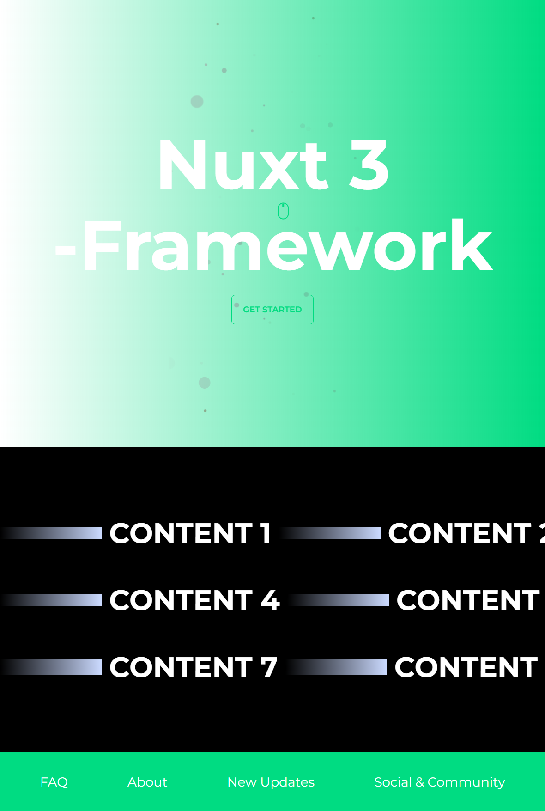

<p align="center">

</p>

<h2 align="center">
<a href="https://github.com/antfu/vitesse">Starter Kit</a> for Nuxt 3
</h2><br>

<pre align="center">
🧪 Working in Progress
</pre>

<p align="center">
<br>
<a href="https://willowy-pixie-68f3c2.netlify.app/">🖥 Online Preview</a>
</p>

## Features

- [💚 Nuxt 3](https://v3.nuxtjs.org) - SSR, ESR, File-based routing, components auto importing, modules, etc.

- ⚡️ Vite - Instant HMR

- 🎨 [Tailwindcss](https://tailwindcss.com) - A utility-first CSS framework for rapid UI development.

- 😃 Use icons from any icon sets in Pure CSS, powered by [UnoCSS](https://github.com/antfu/unocss)

- 🔥 The `<script setup>` syntax

- 🍍 [State Management via Pinia](https://pinia.esm.dev), see [./composables/user.ts](./composables/user.ts)

- 📑 [Layout system](./layouts)

- 📥 APIs auto importing - for Composition API, VueUse and custom composables.

- 🏎 Zero-config cloud functions and deploy

- 🦾 TypeScript, of course

## Plugins

### Nuxt Modules

- [VueUse](https://github.com/vueuse/vueuse) - collection of useful composition APIs.
- [ColorMode](https://github.com/nuxt-community/color-mode-module) - dark and Light mode with auto detection made easy with Nuxt.
- [Tailwindcss](https://tailwindcss.com) - A utility-first CSS framework for rapid UI development.
- [Pinia](https://pinia.esm.dev/) - intuitive, type safe, light and flexible Store for Vue.

### Nuxt Plugins

- [Gesture](https://github.com/vueuse/gesture) - Vue Composables making your app interactive.
- [LottieWeb](https://github.com/airbnb/lottie-web) - Vue.js toast notification plugin for vue 3.
- [Toast](@meforma/vue-toaster) - Vue.js toast notification plugin for vue 3.
- [DaisyUI](https://github.com/saadeghi/daisyui) - The most popular, free and open-source Tailwind CSS component library.
- [Marquee](https://github.com/megasanjay/vue3-marquee) - A simple marquee component with ZERO dependencies for Vue 3.

## IDE

We recommend using [VS Code](https://code.visualstudio.com/) with [Volar](https://github.com/johnsoncodehk/volar) to get the best experience (You might want to disable Vetur if you have it).

## Try it now!

### GitHub Template

[Create a repo from this template on GitHub](https://github.com/jackhuynh95/nuxt3-starter/generate).

### Clone to local

If you prefer to do it manually with the cleaner git history

```bash
npx degit jackhuynh95/nuxt3-starter my-nuxt3-app
cd my-nuxt3-app
pnpm i # If you don't have pnpm installed, run: npm install -g pnpm
```